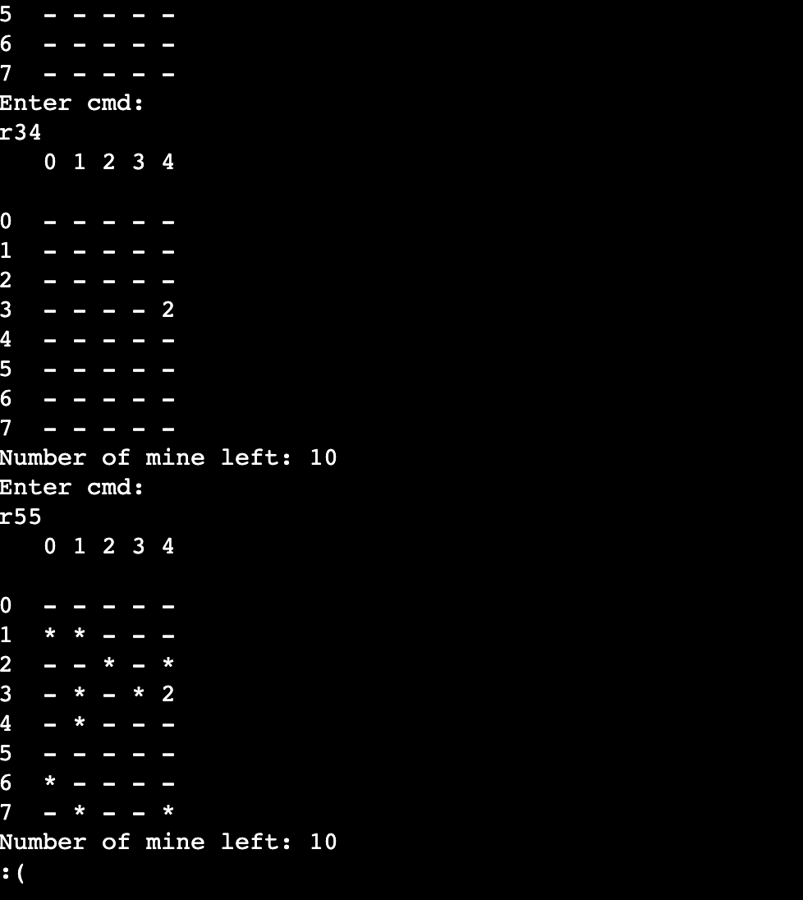

# MineSweeper

This is a terminal-based Minesweeper game built in C++. The game simulates an 8×5 grid using individual cell variables and implements basic mine flagging and reveal logic without using arrays.

## 🎮 Gameplay

- **rXY** → Reveal cell at row X, column Y  
- **fXY** → Flag cell at row X, column Y  
- **uXY** → Unflag cell at row X, column Y  

Example commands:
```
r34
f21
u21
```

## 🧠 Features

- Manual cell tracking (no arrays)
- Randomized mine placement
- Surrounding mine count display
- Recursive reveal when a 0-cell is clicked
- Win/loss detection

## 💻 How to Run

1. Compile the game:
    ```bash
    g++ minesweeper.cpp -o play
    ```

2. Run the game:
    ```bash
    ./play
    ```

3. Follow prompts to enter commands and play.

## 📷 Screenshot



> Screenshot from gameplay on an online compiler

## 📁 File Overview

- `minesweeper.cpp` – Main game logic using cell-by-cell state variables
- `play` – Compiled executable (ignored in `.gitignore`)
